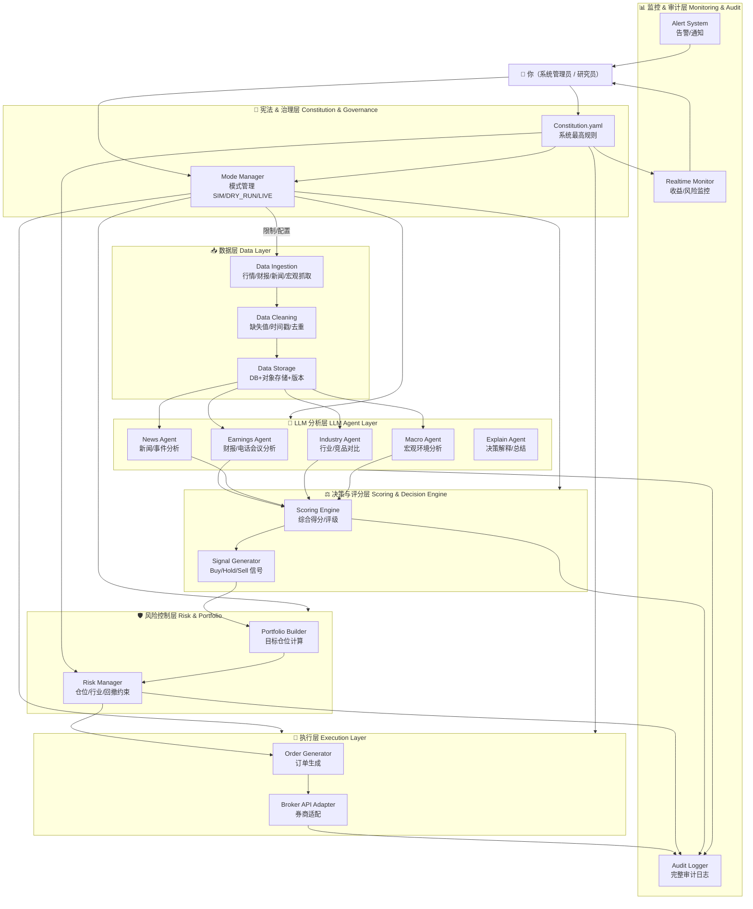
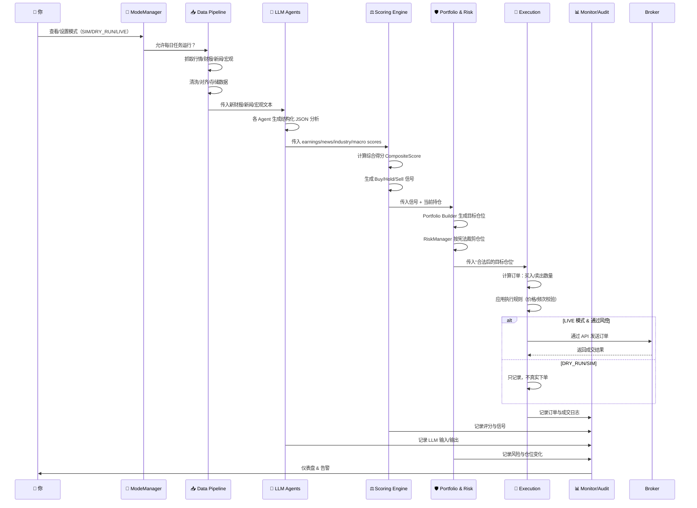
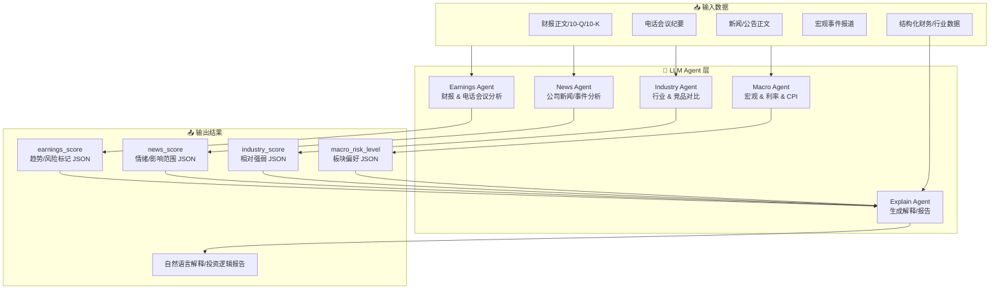
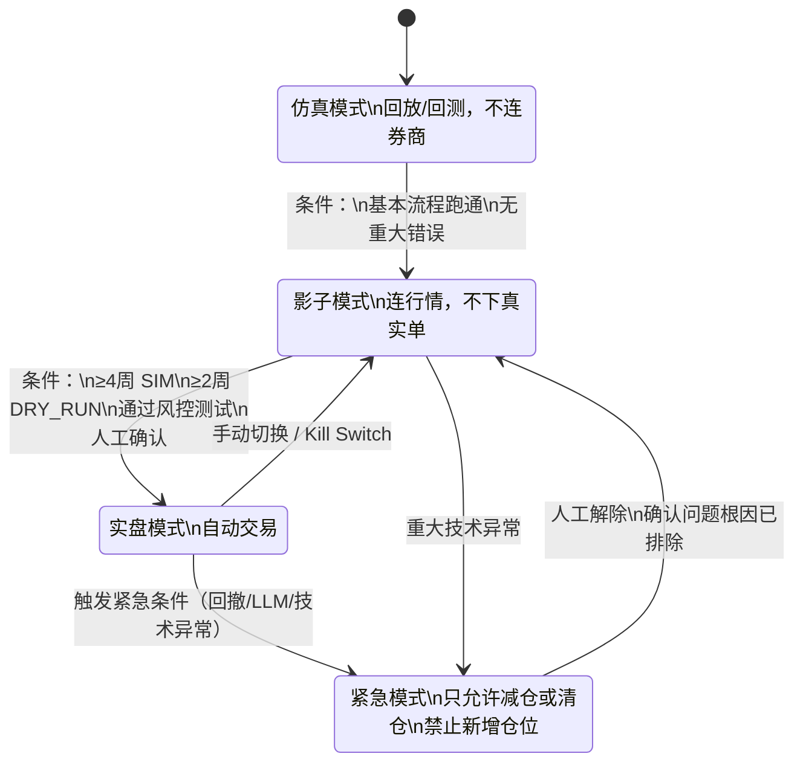
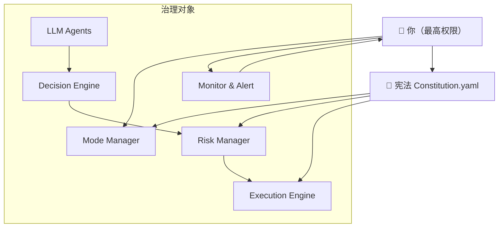

# LLM 自动化投资系统架构概要

> 目标：基于财报 / 新闻 / 宏观 / 行业信息，使用 LLM 做分析，用规则与风控做决策与执行。

---

## 1. 顶层架构



---

## 2. 日常端到端流程



---

## 3. LLM Agent 结构



---

## 4. 决策 - 风控 - 执行链

```mermaid
graph LR
    Signals[⚖️ Signal Generator<br/>Buy/Hold/Sell 信号]
    PB[Portfolio Builder<br/>目标仓位计算]
    RM[🛡️ Risk Manager<br/>应用宪法风险约束]
    OG[Order Generator<br/>订单生成]
    EC[Execution Checker<br/>执行规则检查]
    API[Broker API<br/>券商接口]

    CONST[🧾 Constitution.yaml<br/>风险/权限/回撤规则]

    Signals --> PB --> RM --> OG --> EC --> API

    CONST --> RM
    CONST --> EC

    subgraph Decisions[决策路径]
        Signals --> PB --> RM
    end

    subgraph RiskControls[风险控制点]
        RM:::risk
        EC:::risk
    end

    classDef risk fill=#ffeeee,stroke=#cc0000,stroke-width=2px;

    RM -->|拒绝 / 裁剪仓位| OG
    EC -->|拒绝订单 / 触发停机| API
```

---

## 5. 模式状态机



---

## 6. 治理关系


